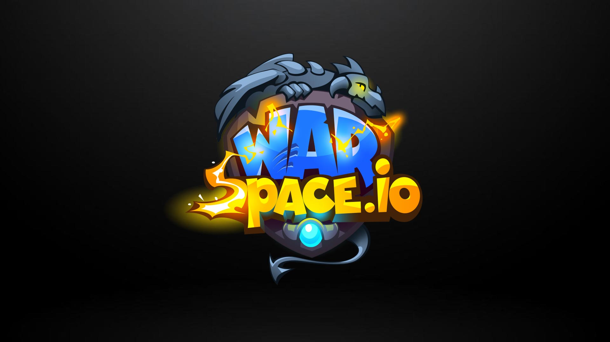

# WarSpace

Introduction: \
\
This document will be updated regularly. Any information given here is subject to change, values may be updated, but in general the basic structure remains the same, and any major changes will be announced.

Where our story begins**:**

The last war completely destroyed the economics of all powerful nations. Peace was made and the race for development and reconstruction began. But the conflict has not been resolved and a repeat of the past is inevitable. Only time will tell us if there will be a new winner!

**WarSpace** - is an NFT-based play to earn game developed on the WAX blockchain. Thanks to the tokenized economy, players themselves control the market and build trade relations. Everyone can choose their own path: develop stone mining, engage in logging, restore the food industry or go deep underground in search of gold. Resources are needed to build new buildings, as well as to participate in pvp-battles (will be available later).
