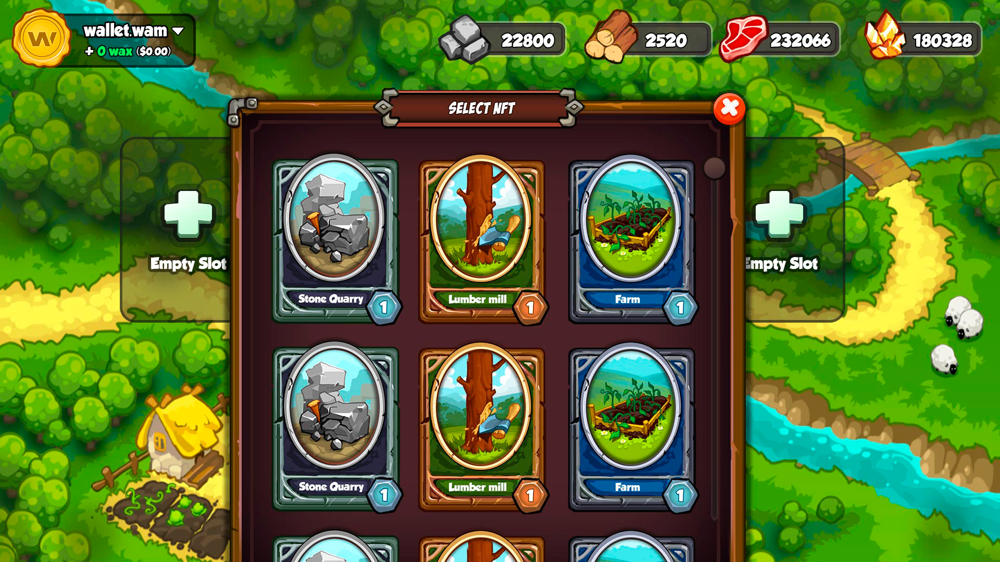
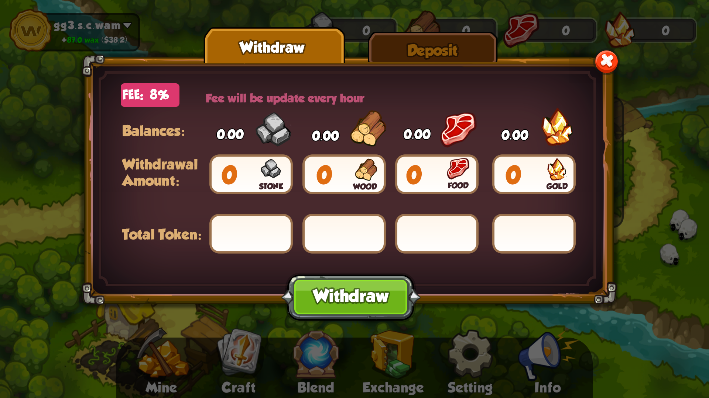

# GamePlay

The game is set in a lost world filled with rich resources that players have to mine. There are 4 different types of resourses in game: STONE, WOOD, GOLD and FOOD. Each of them can be exchanged for other one.&#x20;

Players will have to choose their development strategy: extract a certain resource and improve their buildings as quickly as possible. Or develop several areas at the same time, creating a more functional production. This will ensure independence and security from market fluctuations.

The in-game inventory will hold an infinite number of items for crafting.

Deposit/withdraw of tokens is carried out through the in-game exchange:

For the withdrawal of resources into tokens, players are charged a fee. This indicator is variable, it may vary from 1 to 8% depending on the market situation.

To enter the game you will be able to use the following options:

