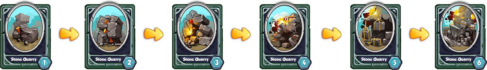
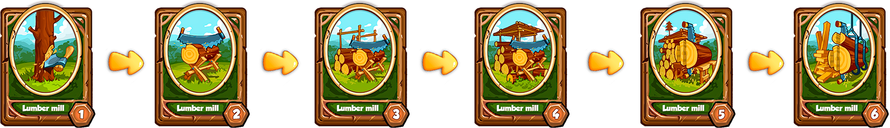
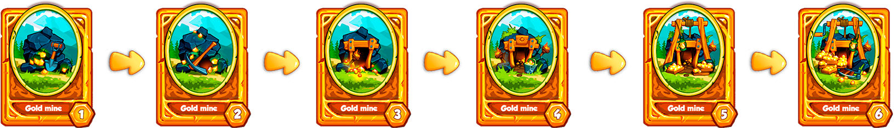
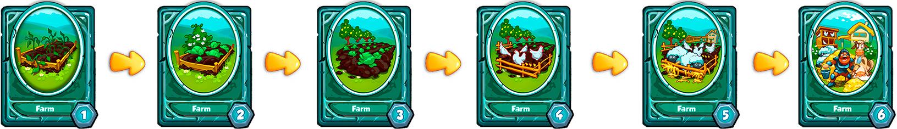

# 4⃣ Multi-level systems

Players will be able to enhance their buildings through the smart blending system.\
The illustration below shows images of WarSpace digital items (NFT \*) that will be used for resource extraction.

